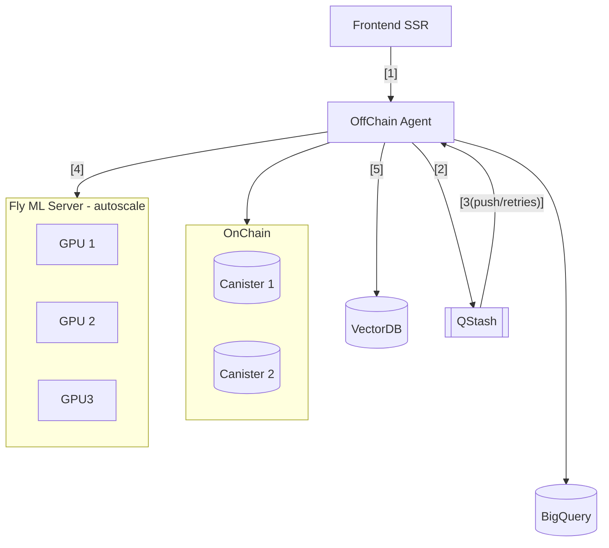
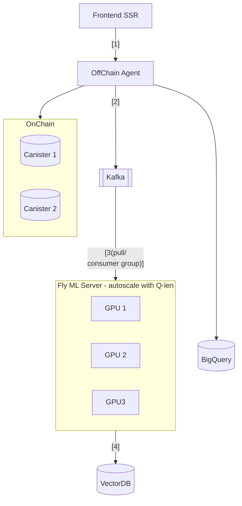

```mermaid
flowchart TD
    Cansiter1[(Canister 1)]
    Cansiter2[(Canister 2)]
    OffChainAgent[OffChain Agent]
    Frontend[Frontend SSR]
    GPU1[GPU 1]
    GPU2[GPU 2]
    BigQuery[(BigQuery)]
    VectorDB[(VectorDB)]
    QStash[[QStash]]

    OffChainAgent --> OnChain
    OffChainAgent ---> BigQuery

    Frontend --[1]--> OffChainAgent

    OffChainAgent --[2]--> QStash
    QStash --[3(push/retries)]--> OffChainAgent
    OffChainAgent --[4]--> FlyMLServer
    OffChainAgent --[5]--> VectorDB

    subgraph OnChain
        Cansiter1
        Cansiter2
    end

    subgraph FlyMLServer[Fly ML Server - autoscale]
        GPU1
        GPU2
        GPU3
    end
```

Pros:

Cons:

--------------------------------

```mermaid
flowchart TD
    Cansiter1[(Canister 1)]
    Cansiter2[(Canister 2)]
    OffChainAgent[OffChain Agent]
    Frontend[Frontend SSR]
    GPU1[GPU 1]
    GPU2[GPU 2]
    BigQuery[(BigQuery)]
    VectorDB[(VectorDB)]
    Kafka[[Kafka]]

    OffChainAgent --> OnChain
    OffChainAgent ---> BigQuery

    Frontend --[1]--> OffChainAgent

    OffChainAgent --[2]--> Kafka
    Kafka --[3(pull/<br>consumer group)]--> FlyMLServer
    FlyMLServer --[4]--> VectorDB

    subgraph OnChain
        Cansiter1
        Cansiter2
    end

    subgraph FlyMLServer[Fly ML Server - autoscale with Q-len]
        GPU1
        GPU2
        GPU3
    end
```

Pros:

Cons:

