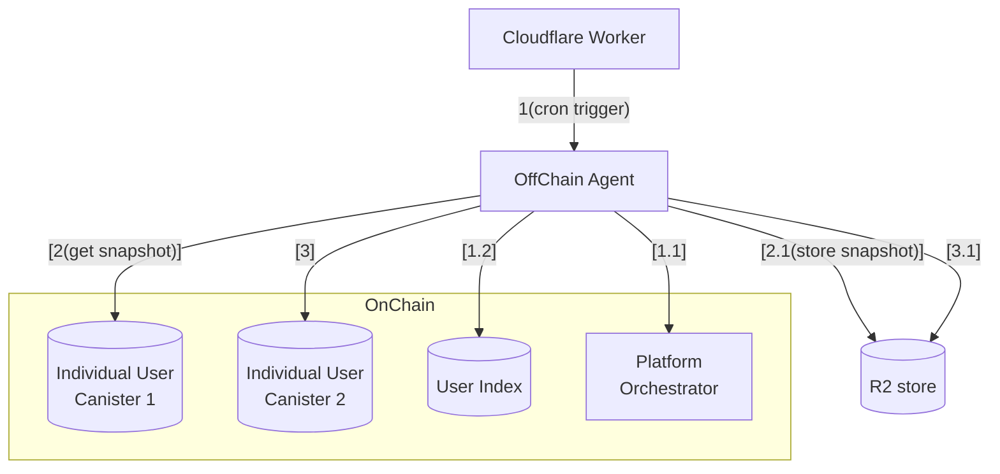
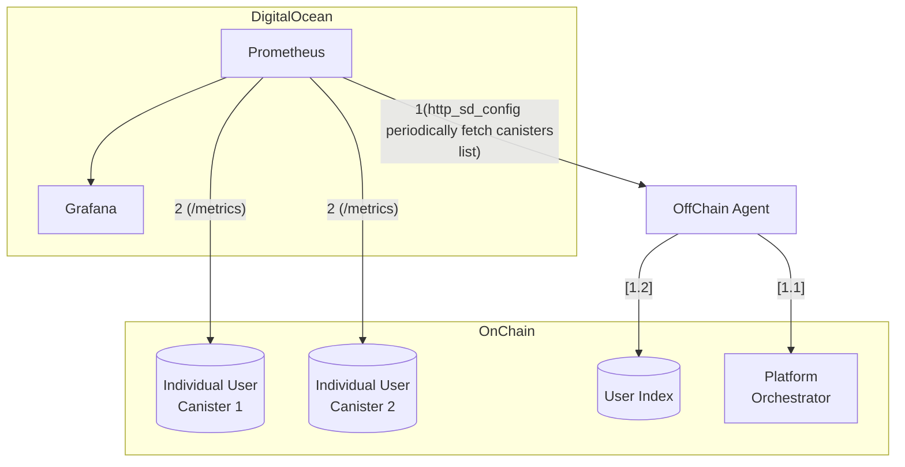

# Off-Chain-Agent

## Overview

Off-chain agent is a service that runs on Fly.io and is responsible for orchestrating the off-chain operations of the platform. It is responsible for the following:

- Daily backups for disaster recovery
- Monitoring

## Architecture 

### Periodic Backups

### Monitoring

