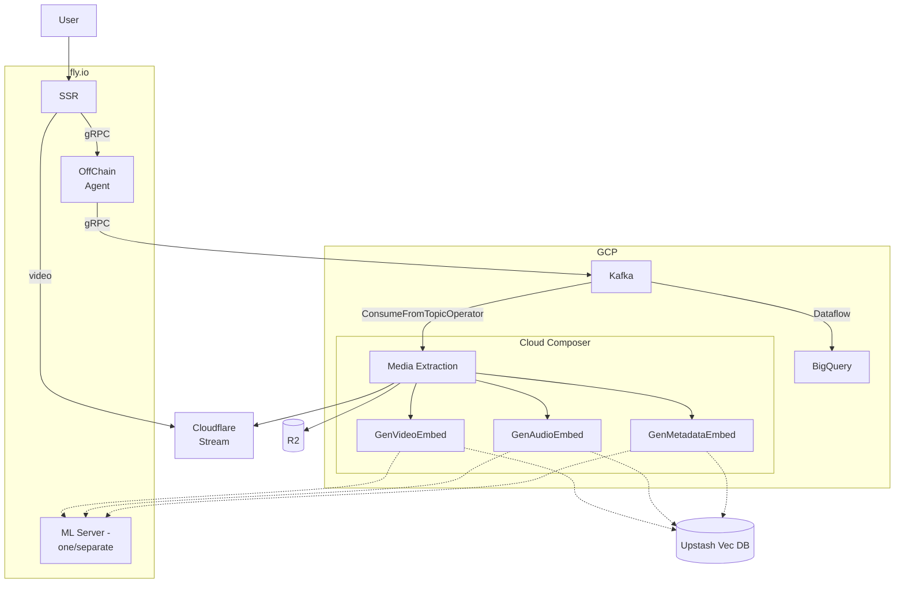
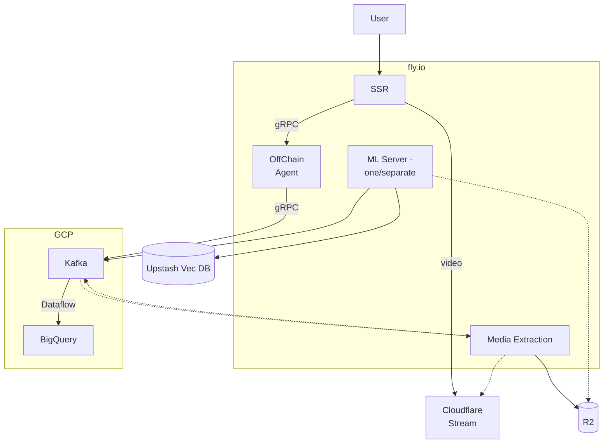

# With CLoud Composer

# Without CLoud Composer

## Cloud Composer

**with**

- extensible (easy to add new steps in pipeline)
- switching to batch operations is easy

**without**

- simple to start with
- tightly coupled, not modular
- adding new steps will require spinning up separate services or containers.

To be looked into

1. Model hosting

- FlyGPU or plain
- single or separate

2. Model periodic training and CI
3. Attempt Retry for failed jobs - Ariflow retry / exponential backoff + jitter
